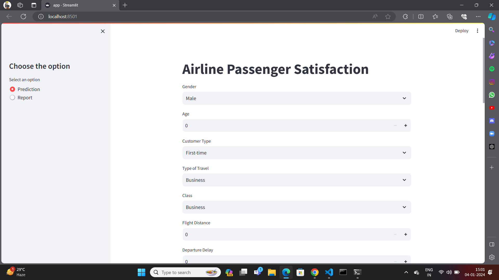

#  Airline Passenger Satisfaction 

The goal of creating an ML (Machine Learning) model using this dataset could be to predict or understand the factors that contribute most significantly to customer satisfaction or dissatisfaction with their flight experience.

**Data Source :**  https://www.kaggle.com/datasets/mohamedhamdymady/airline-passenger-satisfaction?resource=download

## steps to follow

## 1.clone the repository in IDL
```bash
git clone https://github.com/MaheshGowda47/Airline_Passenger_Satisfaction_MLOps.git
```

## 2.Setting Up the Environment
```bash
python3 -m venv MYENV
```

## 3.Activate the Virtual Environment
To activate the virtual environment (assuming it's named MYVENV), use the following command:

```bash
source MYVENV/bin/activate
```

## 4.Install Required Packages

```bash
python3 -m pip install -r requirements.txt
```

## 5.add the path
To run streamlit app in terminal:

```bash
cd project
```

## 6.Run streamlit

```bash
streamlit run app.py
```

## streamlit interface

```

```